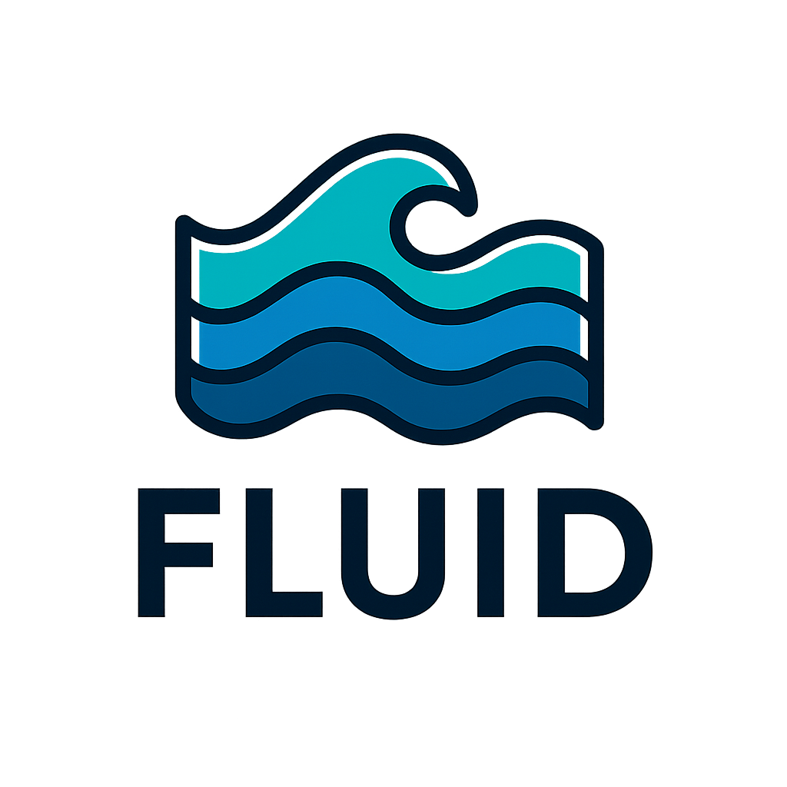

<p align="center">
  
</p>

# Federated Layered Unified Interchange Definition.

> **The open, declarative standard for Data Products.**  
> FLUID provides the foundational protocol for building trustworthy, governable, and scalable data ecosystems—ready for the agentic era.

Go straight to the [FLUID specification](https://github.com/open-data-protocol/fluid/blob/main/specification.md)
Or see it in action [FLUID examples](https://github.com/open-data-protocol/fluid/blob/main/examples.md)
; it even has a defined [FLUID schema](https://github.com/open-data-protocol/fluid/blob/main/fluid-schema.json)
like it? contribute... [FLUID contributions](https://github.com/open-data-protocol/fluid/blob/main/contribute.md)

---

## 🚀 Vision: Your Data, Ready for the Agentic Revolution

The enterprise is on the verge of a paradigm shift: from process automation to an Agentic Ecosystem, where autonomous AI agents drive operations. This transition, powered by standards like the Model Context Protocol (MCP), exposes a foundational crisis—our data infrastructure is a patchwork of brittle, imperative pipelines, fundamentally unready for agentic consumption.

**FLUID** (Federated Layered Unified Interchange Definition) is introduced as an open-source specification to solve this crisis. FLUID reframes data from a pipeline byproduct into a first-class Data Product with a clear interface, contract, and implementation. By providing a declarative, version-controlled, and unified definition for every data asset, FLUID establishes the trustworthy, governable, and scalable data fabric necessary for the agentic era.

Agents can't operate in a vacuum—they require access to data that is:

- Discoverable
- Trustworthy
- Context-aware

Without it, agents inherit brittle pipelines, stale lineage, and governance nightmares.

---
## The Looming Crisis of Context

The "modern data stack"—a disaggregated ecosystem of best-in-class tools—has enabled rapid progress, but is held together by fragile scripts, proprietary configs, and tribal knowledge. This complexity, manageable by humans, becomes a liability in the Agentic Revolution.

**Agentic AI**—capable of complex reasoning and autonomous tool use—will soon be the primary consumer of enterprise data. Their potential, however, is capped by the quality and reliability of accessible data.

**Key Questions:**
- How can an agent trust the data it consumes?
- How does an agent discover the correct data product?
- How can we govern and audit thousands of autonomous agents accessing sensitive data?

The current landscape, built on disconnected pipelines, offers no scalable answers. Deploying agents atop this foundation is like building a skyscraper on sand. What’s needed is a paradigm shift: from data as pipeline output to data as a product with a contract.

**FLUID** is that foundational, declarative protocol.

---

## What FLUID Is (and Is Not)

### What It Is: A Declarative Protocol for Data Products

FLUID is a **declarative specification** (YAML, version-controlled) that defines a data product in its entirety. It is not an execution engine, but a universal language for tools across the data ecosystem.

**Core Philosophy:**
- **Federated:** Distributed, co-located with code and teams, enabling domain-oriented data mesh.
- **Layered:** Supports logical layers (Bronze, Silver, Gold) for data refinement.
- **Unified:** Unifies the entire data product lifecycle—interface, dependencies, build logic, contracts, and access policies.
- **Interchange Definition:** A common format for exchanging data product definitions between tools, teams, and agents.

**Primary Interfaces:**
- `exposes` (Output Port): Public interface—location, contract (schema, quality, privacy), access policy, capabilities.
- `consumes` (Input Port): Dependencies—physical sources or other FLUID products.
- `build` (Implementation): Logic for output creation—transformation engine, execution runtime, state management.

This structure separates the "what" (interface) from the "how" (construction), enabling scalable, understandable data ecosystems.

### What It Is Not: A Monolithic Executor

FLUID is **not** a new central tool or platform. It does not replace Airflow, dbt, or Snowflake. It does **not** require a monolithic "Agentic Executor."

Instead, FLUID fosters a **decentralized, compliant ecosystem**. Tools become "FLUID-aware"—for example, Airflow dynamically generates DAGs from FLUID files, and data catalogs ingest lineage from FLUID repositories. FLUID is the shared language, not the central brain.

---

## Why FLUID Is Indispensable in an MCP World

**Can’t a smart AI just “get the data”? Why bother with data products?**

No matter how advanced, an AI agent cannot operate on data it does not understand or trust. Connecting to raw databases is a liability, not an asset. FLUID closes three critical gaps:

- **Semantic Gap:** Without a contract, data is just bits. FLUID’s contract and semantics provide essential context—schema, descriptions, business ontology links.
- **Trust Gap:** How does an agent know data is correct or fresh? FLUID’s quality and SLA blocks provide enforceable guarantees.
- **Governance Gap:** How do we control and audit agent access? FLUID’s accessPolicy and dynamicPolicies create a programmatic access control layer.

**Conclusion:** AI cannot “just get the data.” FLUID provides the machine-readable contracts and policies that transform raw data into safe, trustworthy, and understandable Data Products.

---

## 📈 Why Mandate FLUID?

### 1️⃣ Drastically Reduce Operational Risk & Complexity

- Replace glue code with declarative `.fluid.yml`
- Built-in governance, compliance & versioning

### 2️⃣ Increase Innovation Velocity

- Treat data as products
- Discoverable, composable, contract-driven data

### 3️⃣ Future-Proof for the Agentic Era

- Machine-readable
- Secure
- Ready for AI-first enterprise infrastructure

---

## 🏗️ Core Principles

| Principle               | Description                                                                 |
|-------------------------|-----------------------------------------------------------------------------|
| **Data as a Product**   | The core mental model of FLUID is to shift from thinking about "pipelines" to thinking about "products." A pipeline is an imperative process. A product is a versioned asset with a defined interface, quality guarantees, and a clear owner. FLUID files are the specification for these products.                         |
| **Declarative, Not Imperative**         | You define the desired end state of your data product—what it consumes, what it exposes, and the contract it must adhere to. You do not define the step-by-step "how." This is the job of a FLUID-compliant tool, which reads your definition and figures out the best way to implement it.                     |
| **Contracts as Code**   | The contract block is the heart of every data product. It embeds schema, quality rules, and privacy treatments directly into a version-controlled file. This makes governance an automated, proactive part of the development lifecycle, not a reactive, manual process.                          |
| **Federated Ownership** | FLUID is designed for a Data Mesh. .fluid.yml files are intended to be decentralized and co-located with the domain teams that own them. The standard's use of globally unique dataProduct names allows a central orchestrator or catalog to discover these distributed files and weave them into a single, unified data fabric.                       |
| **Compliant Ecosystem** | FLUID is not a monolithic platform. It is a standard that delegates execution to the tools you already use. An orchestrator, a catalog, or an ingestion service becomes "FLUID-aware" by learning to read .fluid.yml files to configure itself. This fosters an open, composable ecosystem rather than creating a new silo.                 |

---

## ✨ A Journey Through FLUID: From Source to Consumer
The power of FLUID is best understood by following the logical layering of data products.

### 🥉 Example 1: The Source-Aligned Data Product (Bronze Layer)
This is the first step: creating a reliable, contract-driven product directly from a source system. This example shows a hybrid ingestion pattern from an on-premise Kafka topic to the cloud. A FLUID-compliant, cloud-native ingestion service would read this file and know exactly how to configure itself.

```yaml
# finance.bronze.raw_payments.fluid.yml
fluidVersion: 1.1
kind: DataProduct

metadata:
  dataProduct: finance.bronze.raw_payments
  owner: { team: 'data-platform' }
  description: "Ingests raw, unprocessed payment events from the on-prem Kafka topic. This product ensures that only valid, well-formed JSON enters our cloud ecosystem."
  tags: { layer: 'bronze', domain: 'finance' }

# Defines the source system the ingestion tool will connect to.
consumes:
  - type: kafka
    connection: secret:onprem-kafka-cluster-creds
    format: { type: 'json' }
    properties:
      topic: 'prod.financial.payments'

# Defines where the data lands and, crucially, the contract it MUST adhere to.
exposes:
  location:
    type: gcs
    format: { type: 'parquet' }
    properties:
      bucket: 'prod-finance-landing-zone'
      path: 'payments/daily/'
  
  # A cloud-native ingestion tool reads this and applies these rules IN-FLIGHT.
  contract:
    schema: { columns: [{name: paymentId, type: STRING}, {name: amount, type: NUMERIC}, {name: currency, type: STRING}, {name: user_pii, type: JSON}] }
    quality:
      - rule: "amount > 0"
        onFailure: { action: 'reject_row' }
      - rule: in_set
        columns: [currency]
        set: ['USD', 'EUR', 'GBP']
        onFailure: { action: 'quarantine_row', location: 'gs://prod-finance-quarantine/payments/' }
    privacy:
      - classification: PII
        columns: [user_pii]
        treatment: { type: masking, properties: { maskType: redact } }

build:
  execution:
    trigger: { type: 'streaming' }
    runtime: { type: 'gcp-dataflow', properties: { jobTemplate: 'kafka-to-gcs-with-contracts-v1' } }

```

### 🥈 Example 2: The Domain-Aligned Data Product (Silver Layer)
This product consumes one or more Bronze products to create a clean, modeled, and business-centric view. This is the classic use case for a tool like dbt.

```yaml
# marketing.silver.transformed_campaign_performance.fluid.yml
fluidVersion: 1.1
kind: DataProduct

metadata:
  dataProduct: marketing.silver.transformed_campaign_performance
  owner: { team: 'marketing-analytics' }
  description: "A clean, modeled table of campaign performance."
  tags: { layer: 'silver', tool: 'dbt' }

consumes:
  - type: fluid-product
    name: marketing.bronze.raw_campaign_spend

exposes:
  location:
    type: bigquery
    properties: { project: 'bq-prod-lakehouse', dataset: 'silver', table: 'campaign_performance' }
  contract:
    inheritFrom: dbt
    model: 'campaign_performance'
  accessPolicy:
    visibility: internal

build:
  transformation:
    engine: dbt
    properties:
      projectDir: './dbt/marketing_project/'
      command: 'build'
      models: ['+campaign_performance']
  execution:
    trigger: { type: 'schedule', properties: { cron: '0 4 * * *' } }
    runtime: { type: 'airflow' }
```

### 🥇 Example 3: The Consumer-Aligned Data Product (Gold Layer)
This product is tailored for a specific use case, like an MCP Agent or an ML pipeline. It consumes trusted Silver products and exposes a secure, purpose-built interface.

```yaml
# ml.gold.customer_churn_features.fluid.yml
fluidVersion: 1.1
kind: DataProduct

metadata:
  dataProduct: ml.gold.customer_churn_features
  owner: { team: 'ml-engineering' }
  description: "Serves features for the live customer churn prediction model. Access is restricted to the ML agent."
  tags: { layer: 'gold', consumer: 'ml-agent' }

consumes:
  - type: fluid-product
    name: customers.silver.trusted_customers
  - type: fluid-product
    name: sales.silver.clean_orders

exposes:
  location:
    type: redis
    connection: secret:ml-feature-store-redis-creds
  contract:
    schema: { columns: [{name: customer_id, type: STRING}, {name: ltv, type: NUMERIC}, {name: last_seen_days, type: INT64}] }

  # Access is tightly controlled.
  accessPolicy:
    visibility: private
    grants:
      - principal: agent:churn-prediction-model-v2
        permissions: [readData]

build:
  transformation:
    engine: python
    properties:
      entrypoint: 'feature_engineering/churn_features.py:calculate_features'
  execution:
    trigger: { type: 'schedule', properties: { cron: '0 1 * * *' } }
    runtime: { type: 'gcp-cloud-run' }

```

---

## 🙋‍♀️ FAQ & Critical Review (The Black Hat Perspective)

A specification is only as strong as its ability to withstand scrutiny. Here, we address the toughest questions head-on.

### 1❓Isn't this just another layer of abstraction that complicates things?
A: This is a crucial distinction. FLUID is not an "abstraction layer" in the traditional sense; it's a unifying protocol. Today, you write dbt models, then separate Airflow DAGs, and perhaps other scripts for quality checks. These are disconnected artifacts. FLUID unifies this into a single file, eliminating "glue code" and making the complexity contained and explicit, not created.

### 2❓Does this replace my existing tools like Airflow or dbt?
A: No. FLUID makes them radically better by becoming their most reliable source of truth. The vision is for a decentralized ecosystem of "FLUID-aware" tools. An orchestrator becomes compliant by having a provider that can read a .fluid.yml file and dynamically generate the correct DAG. A transformation tool becomes compliant by reading the consumes block to find its sources.

### 3❓The "Agentic Executor" sounds mythical. How does this actually get implemented?
A: The "Agentic Executor" is a concept, not a monolith. The power of FLUID is that it delegates execution to a compliant ecosystem. A CI/CD pipeline (e.g., GitHub Actions) is the practical "executor." When a .fluid.yml file is changed, the CI/CD job can trigger a series of compliant tools to act on it.

### 4❓What happens when I need a complex Python transformation? Doesn't that break the declarative model and lineage?
A: This is a fair critique of purely automated solutions. FLUID is pragmatic. The specification includes a build.transformation.lineage block. For Python transformations, the developer is responsible for explicitly declaring the column-level mappings. This makes the "escape hatch" auditable and keeps the lineage graph complete.

### 5❓This seems like a massive cultural shift. How can any large organization realistically adopt it?
A: Through incremental, value-driven adoption. The federated nature of FLUID is specifically designed for this. It does not require a "big bang" rollout. Start with one high-value domain team. Once they produce demonstrably better, more reliable data products faster than anyone else, a gravitational pull is created for other teams to adopt the standard.

---

## 📚 Learn More

📖 [FLUID v1.0 Full Specification](https://github.com/open-data-protocol/fluid/blob/main/specification.md)
🧑‍💻 [Contributing Guide](#)  
📜 [License (MIT)](LICENSE.md)

---

## 🤝 Join the Movement

FLUID is an open-source standard, and we welcome contributions from the community! Whether you are interested in refining the specification, building compliant tools, or creating new examples, there are many ways to get involved.

- Help build the **agentic data future**
- Contribute examples, tooling, or feedback
- Be part of an open, community-led protocol

---

> **Your agents are only as trustworthy as the data products they consume. Make FLUID your foundation.**

📄 License
This project is licensed under the MIT License - see the LICENSE.md file for details.
