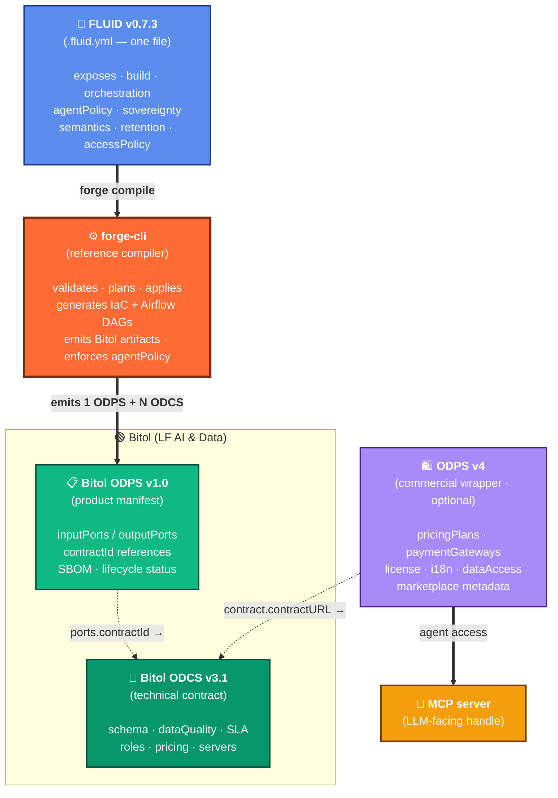

<p align="center">
  
</p>

# Federated Layered Unified Interchange Definition (FLUID)

> **The open, declarative standard for Data Products.**  
> FLUID provides the foundational protocol for building trustworthy, governable, and scalable data ecosystems—ready for the agentic era.

**Quick Start:**
- 🧭 [**FLUID at a Glance**](#-fluid-at-a-glance) — one screen, every top-level block, version-stamped
- 🟢 [**Minimal Valid Contract**](#-minimal-valid-contract) — smallest file that validates
- 📖 [FLUID Specification](https://github.com/open-data-protocol/fluid/blob/main/specification.md)
- 🔗 [JSON Schema v0.7.3 (latest)](https://github.com/open-data-protocol/fluid/blob/main/schema/fluid-schema-0.7.3.json) · [v0.7.2](https://github.com/open-data-protocol/fluid/blob/main/schema/fluid-schema-0.7.2.json) · [v0.7.1](https://github.com/open-data-protocol/fluid/blob/main/schema/fluid-schema-0.7.1.json)
- 📚 [Schema Anatomy](docs/anatomy.md) · [Schema Cheatsheet](docs/schema-cheatsheet.md)
- 🚀 [Examples in Action](https://github.com/open-data-protocol/fluid/blob/main/examples.md)
- 🤝 [Contributing Guide](https://github.com/open-data-protocol/fluid/blob/main/contribute.md)
- 🆕 [What's New in v0.7.3](#-whats-new-in-fluid-073) · [v0.7.2](#-whats-new-in-fluid-072) · [v0.7.1](#-whats-new-in-fluid-071)

---

## 🧭 FLUID at a Glance

A FLUID contract is one YAML file. The shape below shows **every top-level block** in v0.7.3, with one-line meaning and the version each was introduced. Required blocks are marked `[req]`; everything else is opt-in.

```yaml
fluidVersion: "0.7.3"            # [req] which contract version this file targets
kind: DataProduct                # [req] DataProduct | MLPipeline
id:   domain.layer.name          # [req] globally unique product id
name: "Human-readable name"      # [req] display name
description: "..."               #       business-facing summary
domain: "Finance"                #       owning business domain
tags:   [pii, gold-layer]        #       free-text categorization
labels: { team: analytics }      #       key/value categorization

metadata:                        # [req] only metadata.owner is required
  owner: { team, email }         # [req] team is the one truly required field
  layer: Gold                    #       free-form; convention: Bronze | Silver | Gold

consumes: [ ... ]                #       upstream FLUID products you depend on
exposes:  [ ... ]                # [req] ports you publish (each requires exposeId+kind+contract+binding)
  └── contract                   # [req] schema columns (or openapiRef), dq rules
  └── semantics                  #         ⭐ 0.7.2 — entities, measures, dimensions, metrics
  └── policy                     #         authn, authz, privacy, classification, agentPolicy (⭐ 0.7.1)
  └── binding                    # [req] where it lives (platform + format + location, + icebergConfig*)

build:                           #       how the product is produced
  pattern: hybrid-reference      #       | embedded-logic | multi-stage | acquisition (⭐ 0.7.3)
  engine:  dbt | sql | python | spark | glue | custom | duckdb | airbyte | meltano | dlt | kafka-connect | debezium
  properties: { ... }            #       pattern-specific block — acquisitionPattern when pattern=acquisition (⭐ 0.7.3)

orchestration: { engine: airflow | dagster | prefect | kubeflow | custom | none, tasks: [...] }   # ⭐ 0.7.0+
sovereignty:   { jurisdiction, allowedRegions, deniedRegions, enforcementMode, … }   # ⭐ 0.7.1
accessPolicy:  { grants: [{ principal, permissions, resources, conditions }] }       # ⭐ 0.7.1
retention:     { runState, runLogs, lineage, dlq }                                   # ⭐ 0.7.3
lineage:       { upstream, downstream, fieldLevel }
governance:    { ... }
schemaEvolution: { strategy, compatibility }
machineLearning: { ... }
environments:  { dev: {...}, staging: {...}, prod: {...} }
lifecycle:     { state: preview | active | deprecated | retired }
docs:          { ... }
```

> 💡 **`agentPolicy` location.** AI/LLM consumption policy lives **per-expose** under `exposes[].policy.agentPolicy` — not at the root. (Earlier release notes show it at the top level; the schema has never accepted it there.) See [docs/anatomy.md §7](docs/anatomy.md) for the correct shape.

> 📚 For a one-line-per-field reference with required/optional flags, see the [**Schema Cheatsheet**](docs/schema-cheatsheet.md).
> For a tour of each block with deep-dive links, see the [**Schema Anatomy**](docs/anatomy.md).

---

## 🟢 Minimal Valid Contract

The smallest file that passes JSON Schema validation against v0.7.3 — every other top-level block is opt-in:

```yaml
fluidVersion: "0.7.3"
kind: DataProduct
id:   demo.bronze.hello_world
name: "Hello World"
metadata:
  owner: { team: data-platform }
exposes:
  - exposeId: hello
    kind: table
    contract:
      schema:
        - { name: id, type: STRING, required: true }
    binding:
      platform: local
      format:   parquet
      location: { path: "./hello.parquet" }
```

> **What you can drop:** `description`, `domain`, `tags`, `labels`, `consumes`, `build`, `orchestration`, all governance blocks (`agentPolicy`, `sovereignty`, `accessPolicy`, `retention`), `lineage`, `lifecycle`, `environments`, `docs`. Everything else is layered on as you need it.

See [**examples.md**](examples.md) for the ten-step progression from this minimal file to a production source-aligned acquisition product.

---

## 🔄 How FLUID Compares to ODCS, Bitol ODPS, and ODPS v4

Four active "open data product" specs share overlapping names and adjacent scopes — three are Linux Foundation projects. This section disambiguates them, shows how they fit together, and presents a capability matrix sourced directly from each spec's published JSON Schema.

### TL;DR

- 🟢 **Bitol ODCS** — column-level technical contract (schema · DQ · SLA · roles · pricing tier)
- 🟢 **Bitol ODPS** — thin product manifest that references ODCS contracts via `contractId`
- 🟣 **ODPS v4** — commercial wrapper (pricing plans · payment gateways · license · i18n · marketplace)
- 🔵 **FLUID** — operational superset (contract + build + orchestration + agentic governance + sovereignty + multi-layer DQ + semantics); compiles to Bitol ODPS+ODCS via `forge-cli` for ecosystem interop

> All four are open source (Apache 2.0; FLUID is MIT). They aren't mutually exclusive — see the diagram below.

### Disambiguation — which "ODPS" is which?

| Acronym | Maintainer | Latest | What it is |
|---|---|---|---|
| **ODCS** (Open Data Contract Standard) | LF AI & Data · Bitol | v3.1.0 — Dec 2025 | Column-level technical contract; producer↔consumer agreement for one dataset |
| **Bitol ODPS** (Open Data Product Standard) | LF AI & Data · Bitol | v1.0.0 — Sep 2025 | Thin product manifest; bundles ODCS contracts via `contractId` on input/output ports |
| **ODPS v4** (Open Data Product Specification) | LF · [Open-Data-Product-Initiative](https://github.com/Open-Data-Product-Initiative/v4.0) | v4.0 — Jul 2025 · v4.1 — Oct 2025 | Business + commercial wrapper: pricing · license · multi-language · marketplace |
| **FLUID** | open-data-protocol | v0.7.3 — this repo | End-to-end operational contract: schema + build + orchestration + agentic governance + sovereignty + semantics |

### How they actually fit together


```mermaid
flowchart TB
    classDef fluid     fill:#5B8DEF,color:#fff,stroke:#1E3A8A,stroke-width:2px
    classDef forge     fill:#FF6B35,color:#fff,stroke:#7C2D12,stroke-width:3px
    classDef bitolDp   fill:#10B981,color:#fff,stroke:#064E3B,stroke-width:2px
    classDef bitolDc   fill:#059669,color:#fff,stroke:#064E3B,stroke-width:2px
    classDef odpsv4    fill:#A78BFA,color:#fff,stroke:#4C1D95,stroke-width:2px
    classDef mcp       fill:#F59E0B,color:#fff,stroke:#78350F,stroke-width:2px

    F["📄 <b>FLUID v0.7.3</b><br/>(.fluid.yml — one file)<br/><br/>exposes · build · orchestration<br/>agentPolicy · sovereignty<br/>semantics · retention · accessPolicy"]:::fluid

    FC["⚙️ <b>forge-cli</b><br/>(reference compiler)<br/><br/>validates · plans · applies<br/>generates IaC + Airflow DAGs<br/>emits Bitol artifacts · enforces agentPolicy"]:::forge

    subgraph bitol ["🟢 Bitol (LF AI & Data)"]
        direction LR
        OP["📋 <b>Bitol ODPS v1.0</b><br/>(product manifest)<br/><br/>inputPorts / outputPorts<br/>contractId references<br/>SBOM · lifecycle status"]:::bitolDp
        OC["📐 <b>Bitol ODCS v3.1</b><br/>(technical contract)<br/><br/>schema · dataQuality · SLA<br/>roles · pricing · servers"]:::bitolDc
    end

    V4["🛍️ <b>ODPS v4</b><br/>(commercial wrapper · optional)<br/><br/>pricingPlans · paymentGateways<br/>license · i18n · dataAccess<br/>marketplace metadata"]:::odpsv4

    MCP["🤖 <b>MCP server</b><br/>(LLM-facing handle)"]:::mcp

    F  ==>|"<b>forge compile</b>"| FC
    FC ==>|"<b>emits 1 ODPS + N ODCS</b>"| OP
    OP -.->|"ports.contractId →"| OC
    V4 -.->|"contract.contractURL →"| OC
    V4 ==>|"agent access"| MCP

    click F "https://github.com/open-data-protocol/fluid" "FLUID on GitHub"
    click FC "https://github.com/Agenticstiger/forge-cli" "forge-cli on GitHub"
    click OP "https://github.com/bitol-io/open-data-product-standard" "Bitol ODPS on GitHub"
    click OC "https://github.com/bitol-io/open-data-contract-standard" "Bitol ODCS on GitHub"
    click V4 "https://github.com/Open-Data-Product-Initiative/v4.0" "ODPS v4 on GitHub"
```

> 🖱️ Every node in the diagram links to its source repository.

> **From the forge-cli README:** *"Bitol Open Data Product Standard v1.0.0 as the default, center-stage ODPS"* — export produces *"1 ODPS doc + N sibling `<contractId>.odcs.yaml` files."*

---

### 📊 Capability matrix

Legend: ✅ deterministic in spec · ⚠️ partial · ❌ silent. Headers abbreviated for width: **F** = FLUID v0.7.3 · **ODCS** = Bitol ODCS v3.1 · **ODPS** = Bitol ODPS v1.0 · **v4** = ODPS v4.0. Field-level detail lives in [`docs/schema-cheatsheet.md`](docs/schema-cheatsheet.md) — this matrix is the at-a-glance scoreboard.

#### 📐 Data shape & quality

| Capability | F | ODCS | ODPS | v4 |
|---|---|---|---|---|
| Schema | ✅ | ✅ | ❌ delegated | ❌ delegated |
| Data quality | ✅ 3-layer | ✅ rich | ❌ | ✅ declarative |
| SLA / SLO | ✅ 4 SLOs | ✅ 11 dims | ❌ | ✅ 11 dims |
| Privacy / sensitivity | ✅ 12-value + masking | ✅ per-column | ❌ | ⚠️ metadata only |

#### 🔒 Access, governance & legal

| Capability | F | ODCS | ODPS | v4 |
|---|---|---|---|---|
| Access (IAM) | ✅ grants + conditions | ✅ roles | ❌ | ⚠️ free-text |
| Lineage | ✅ top-level graph | ⚠️ column hints | ⚠️ product-level | ⚠️ pointer |
| AI / LLM governance | ✅ `agentPolicy` | ❌ | ❌ | ⚠️ MCP access only |
| Sovereignty / residency | ✅ jurisdiction + enforcement | ❌ | ❌ | ⚠️ partial |
| Legal framework | ✅ regulatory · 10 + 6 | ❌ | ❌ | ✅ commercial · license / IPR |

#### ⚙️ Build & operations

| Capability | F | ODCS | ODPS | v4 |
|---|---|---|---|---|
| Build / transformation | ✅ 4 patterns | ❌ | ❌ | ⚠️ pointer only |
| Source-aligned ingestion | ✅ 6 engines | ❌ | ❌ | ❌ |
| Orchestration | ✅ Airflow / Dagster / Prefect / Kubeflow | ❌ | ❌ | ⚠️ metadata only |
| Retention | ✅ `retention` | ❌ | ❌ | ❌ |
| Delivery guarantees | ✅ `acquisitionDelivery` | ❌ | ❌ | ❌ |

#### 🧭 Discovery & semantics

| Capability | F | ODCS | ODPS | v4 |
|---|---|---|---|---|
| Semantic model | ✅ `semantics` · [OSI](https://open-semantic-interchange.org/) v1.0 | ❌ | ❌ | ❌ |
| Business metadata | ⚠️ basic | ⚠️ basic | ⚠️ basic | ✅ full i18n `details.<lang>` |
| Multi-access | ✅ `exposes[]` independent | ❌ single | ⚠️ free-form | ✅ 6-value enum |

#### ♻️ Lifecycle & supply chain

| Capability | F | ODCS | ODPS | v4 |
|---|---|---|---|---|
| Lifecycle states | ✅ 4-state | ⚠️ free-form | ✅ 5-state | ✅ 8-state |
| Versioning + schema evolution | ✅ `schemaEvolution` + 4-policy | ⚠️ `version` only | ⚠️ port + product | ⚠️ `productVersion` |
| SBOM | ⚠️ image signature | ❌ | ✅ `sbom[]` | ❌ |

> Each capability links to its field-level reference in [`docs/schema-cheatsheet.md`](docs/schema-cheatsheet.md). MetricFlow round-trip is on the FLUID roadmap.

---

### ⚙️ The reference compiler — `forge-cli`

The matrix above shows what each spec *covers*. **[`forge-cli`](https://github.com/Agenticstiger/forge-cli)** is what turns a FLUID contract into deployed reality and Bitol-compatible outputs.

[](https://github.com/Agenticstiger/forge-cli)
[](https://github.com/Agenticstiger/forge-cli/blob/main/LICENSE)
[](https://agenticstiger.github.io/forge_docs/)

It consumes a `.fluid.yml` and emits:

| Stage | Output |
|---|---|
| 🟢 **Bitol export** | `1 ODPS doc + N <contractId>.odcs.yaml` files — Bitol v1.0.0 as the default, center-stage ODPS |
| 🟠 **Orchestration** | Native **Airflow / Dagster / Prefect** DAGs from the `orchestration` block |
| 🟣 **Infrastructure** | **OpenTofu / Terraform** IaC for BigQuery / Snowflake / AWS / GCP |
| 🔵 **Governance** | **IAM bindings** from `accessPolicy.grants[]` + **AI gateway** enforcement of `agentPolicy` |
| 🔴 **Supply chain** | **Cosign-verified** connector images + **SLSA provenance** checks on ingest |

> *"What Terraform did for infrastructure, FLUID Forge does for data products."* — [forge-cli README](https://github.com/Agenticstiger/forge-cli)

### When to use which

- **Use Bitol ODCS alone** when you need a portable, vendor-neutral **column-level contract** any data-mesh tool can consume. The smallest unit of producer↔consumer agreement.
- **Use Bitol ODPS** when you want a thin manifest to bundle multiple ODCS contracts into one product (ports + SBOM + lifecycle) without build automation or AI governance.
- **Use opendataproducts.org's ODPS v4** when you're **commercializing data products** — pricing tiers, payment integration, multi-language license, marketplace metadata. It expects an ODCS-shaped contract underneath.
- **Use FLUID** as your **authoring layer** when you want one file to drive the full lifecycle — source-aligned acquisition, build, orchestration, agentic governance, sovereignty, multi-layer DQ, and semantics — *and* you want Bitol-compatible outputs for catalog/contract-registry interop. FLUID is the only spec covering the operational + agentic surface today.

### Composing them

The cleanest production stack uses all four where each is strongest:

| Layer | Spec | Role |
|---|---|---|
| Author | **FLUID** | Single `.fluid.yml` per product — version-controlled, schema-validated, agent-policy-enforced |
| Compile | **forge-cli** | Emits Bitol ODPS + ODCS files, generates Airflow DAGs, applies IAM grants, runs DLP pre-land hooks |
| Catalog | **Bitol ODCS + ODPS** | What DataHub / OpenMetadata / Datamesh Manager read for discovery and contracts |
| Commercialize | **ODPS v4** | Wraps the ODCS for external marketplace publishing — pricing, license, multi-language, payment |

### Sources

- [Bitol ODCS — open-data-contract-standard](https://github.com/bitol-io/open-data-contract-standard) (v3.1.0)
- [Bitol ODPS — open-data-product-standard](https://github.com/bitol-io/open-data-product-standard) (v1.0.0)
- [opendataproducts.org ODPS v4](https://opendataproducts.org/v4.0/) · [v4.0 repo](https://github.com/Open-Data-Product-Initiative/v4.0) · [v4.1 release](https://github.com/Open-Data-Product-Initiative/v4.1)
- [forge-cli — the FLUID reference compiler](https://github.com/Agenticstiger/forge-cli) (emits Bitol ODPS + ODCS)
- [Linux Foundation AI & Data — Bitol project](https://lfaidata.foundation/projects/bitol/)

---

## 🤖 The Agentic-Native Layer

**"Agentic-native"** isn't a marketing label — it's a concrete set of failure modes that any data product spec must address before AI agents can safely consume it at production scale. This section maps those failure modes to spec features, **tests them against each spec's own canonical example file**, and is honest about where FLUID also falls short.

### Methodology

Each spec was evaluated against the **canonical example file its maintainers publish**, asking four questions an LLM agent must answer before consuming a data product. Each cell below records whether the spec gives a **deterministic** (✅), **partial** (⚠️), or **silent** (❌) answer.

| Spec | Example file used |
|---|---|
| Bitol ODCS v3.1 | [`full-example.odcs.yaml`](https://github.com/bitol-io/open-data-contract-standard/blob/main/docs/examples/all/full-example.odcs.yaml) (seller/payments contract) |
| Bitol ODPS v1.0 | [`customer-data-product.odps.yaml`](https://github.com/bitol-io/open-data-product-standard/blob/main/docs/examples/customer-data-product.odps.yaml) |
| ODPS v4 | [`urbanpulse_final.yml`](https://github.com/Open-Data-Product-Initiative/v4.0/blob/main/source/examples/Refs/urbanpulse_final.yml) (UrbanPulse Events) |
| FLUID v0.7.3 | [Example 10 (Customers CDC)](examples.md#10-source-aligned-acquisition) |

### The four agent failure modes

These are the failures that get LLM-driven data products taken offline:

| # | Failure mode | What an agent must determine | Real consequence if undetermined |
|---|---|---|---|
| **F1** | **PII leakage** | Which columns are PII? With what masking strategy? | Agent surfaces customer emails / SSNs in answers → privacy incident |
| **F2** | **Disallowed use** | Am I permitted to use this data for *training*? *RAG*? *Credit scoring*? | Model trained on data with `training: deny` → contract breach, lawsuit |
| **F3** | **Metric hallucination** | What is "revenue"? "MRR"? "MAU"? Can I derive them? | Agent invents a SQL expression → wrong number reported to executive |
| **F4** | **Sovereignty violation** | Where is the data located? Am I (running in `us-east-1`) allowed to read EU-resident PII? | Cross-border PII transfer → GDPR fine |

### Results of the test

Honest verdict per spec per failure mode. `✅` = deterministic answer in the spec; `⚠️` = partial (requires inference or external lookup); `❌` = silent.

| | Bitol ODCS v3.1 | Bitol ODPS v1.0 | ODPS v4 (opendataproducts.org) | **FLUID v0.7.3** |
|---|---|---|---|---|
| **F1 — PII leakage** | ⚠️ `classification: restricted` per column gives a tier ("treat as PII") but **no masking strategy** (hash? tokenize? mask?). Agent has to guess. | ❌ Manifest-only; PII detail lives in the referenced ODCS — agent must dereference. | ❌ No per-column classification at the v4 layer; delegated to `contract.contractURL`. | ✅ `column.sensitivity` (12-value enum) **plus** `exposes[].policy.privacy.masking[].strategy` (`mask`/`hash`/`tokenize`/`encrypt`/`k_anonymity`). |
| **F2 — Disallowed use** | ❌ No agent-policy fields. `roles[]` is generic IAM. | ❌ Silent. | ⚠️ Has `pricingPlans` for MCP-agent access tiers and an English-prose `license.scope.restrictions` — but **no machine-readable use-case allow/deny list**. Agent would need NLP on the license text. | ✅ `agentPolicy.allowedUseCases` / `deniedUseCases` use a **12-value controlled vocabulary** (`inference, reasoning, analysis, summarization, classification, embedding, search, qa, code_generation, fine_tuning, training, rag`). Plus `allowedModels` / `deniedModels` and token caps. |
| **F3 — Metric hallucination** | ❌ Has column-level `description` and `businessName` but no metric definitions. Agent asked "what's our revenue?" must guess SQL from column names. | ❌ Silent. | ❌ Has `categories` and `valueProposition` (marketing prose) but no metric definitions. | ✅ `exposes[].semantics.metrics` with `type: simple` / `derived` / `ratio` and explicit `expr`. The agent reads the metric definition verbatim instead of inventing SQL. |
| **F4 — Sovereignty violation** | ❌ `servers[].host` exists but no jurisdiction/region/policy fields. | ❌ Silent. | ⚠️ `license.scope.geographicalArea: [EU, US]` indicates **where the data may be used** (legal scope), and `dataOps.infrastructure.region` hints where it lives — but no enforcement mode. | ✅ `sovereignty.jurisdiction` / `allowedRegions` / `deniedRegions` / `enforcementMode: strict\|advisory\|audit` / `validationRequired: true` — apply-time blocks cross-border bindings. |

### Where FLUID is still maturing — roadmap & honest gaps

The four ✅s above cover the failure modes that matter most for safe agent consumption. Remaining items are operational/tracked-on-roadmap:

- 🛣️ **MCP binding** — `exposes[].binding.mcp` is on the FLUID roadmap. Once landed, FLUID matches ODPS v4's `dataAccess.interface: MCP` for direct LLM tool calls.
- 🛣️ **dbt MetricFlow compatibility** — FLUID's `semantics` block already aligns with the [**OSI (Open Semantic Interchange)**](https://open-semantic-interchange.org/) v1.0 standard (Apache 2.0, Jan 2026); MetricFlow round-trip compatibility is on the roadmap.
- ⚠️ **`purposeLimitation` is free text** — human-readable but not deterministically enforceable without an NLU layer. Shared limitation with every spec that supports purpose clauses.
- ⚠️ **Controlled vocab is mechanism-flavored** — `allowedUseCases: [inference, qa, rag, …]` describes *how* an AI uses the data, not *why*. Business use cases (`credit-scoring`, `marketing-targeting`) live in `purposeLimitation`. A vocabulary extension is under discussion.
- ⚠️ **Semantics is opt-in** — authors who skip the `semantics` block leave F3 (metric hallucination) open. The spec supports it; adoption is the gap.

### What broke when running the tests

Two concrete findings against the canonical examples:

- **F3 — hallucination, against the ODCS example.** Asked *"what was last month's daily transaction volume?"* against the seller/payments contract, a naive LLM agent writes `SELECT txn_ref_dt, COUNT(*) FROM tbl_1 WHERE txn_ref_dt >= DATE_SUB(CURRENT_DATE, 30)`. The contract has no metric defining "transaction volume" and no row-grain documentation, so the SQL is plausible-but-ungrounded. A FLUID `semantics.measures: [{name: transaction_count, agg: count_distinct, expr: txn_id}]` block would have produced a verifiable expression.
- **F4 — sovereignty, against the ODPS v4 example.** UrbanPulse Events declares `license.scope.geographicalArea: [EU, US]`. An agent running in `us-east-1` cannot determine whether that grants *runtime access* or merely *consumer rights of use* — the clause governs the latter. FLUID's `sovereignty.enforcementMode: strict` removes the ambiguity at apply time.

### Complementary protocols worth knowing about

None of these specs replace each other — they live at different layers. Production agentic data products typically combine several:

| Protocol | Layer | What it does | Relationship to FLUID |
|---|---|---|---|
| **[MCP](https://modelcontextprotocol.io/)** (Model Context Protocol) | Access | How an LLM tool calls a data product (JSON-RPC over stdio/SSE). Anthropic-led, broad adoption. | `binding.mcp` on the **FLUID roadmap**. ODPS v4 has it today via `dataAccess.interface: MCP`. |
| **[OSI](https://open-semantic-interchange.org/)** (Open Semantic Interchange) v1.0 | Semantic | Vendor-neutral semantic-layer spec (Snowflake + Databricks + AtScale + Qlik …), Apache 2.0, Jan 2026. | **FLUID `semantics` aligns with OSI** — interoperable with any OSI-compliant BI/AI tool. |
| **[dbt MetricFlow](https://docs.getdbt.com/docs/build/about-metricflow)** / **Snowflake Semantic Views** | Semantic | Engine-specific metric definitions. | FLUID `semantics` is shape-compatible; **MetricFlow round-trip on roadmap**. |
| **[OpenLineage](https://openlineage.io/)** | Lineage events | Runtime lineage events from any tool. | FLUID's `acquisitionPattern.lineage.emit: true` produces OpenLineage events per batch. |
| **[OPA / Rego](https://www.openpolicyagent.org/)** | Policy enforcement | Policy-as-code engine. | An OPA sidecar evaluates FLUID's `accessPolicy` JSONPath selectors at request time. |
| **[Cosign](https://docs.sigstore.dev/cosign/overview/) / [SLSA](https://slsa.dev/)** | Supply chain | Container image signing + provenance. | Required by FLUID's `acquisition.<engine>.image_signature`. |

### Practical conclusion

**FLUID v0.7.3 is the only one of the four specs that gives an LLM deterministic answers to all four agent failure modes today.** That isn't marketing — it's what the test above shows when run against each spec's own canonical example.

FLUID's scope is deliberately the **operational + governance layer** — contract, build, orchestration, agent policy, sovereignty, semantics, DQ. Commercial layers (pricing, payment, multi-language marketplace) are out of scope on purpose; pair FLUID with ODPS v4 when you need them:

```
  FLUID  (author + agent governance + semantics + sovereignty + multi-layer DQ)
    │
    ├── forge-cli → Bitol ODPS + ODCS    (catalog + data-mesh interop)
    │
    └── ODPS v4 wrapper (optional)        (commercial publishing + MCP access)
                  │
                  └── MCP server          (the LLM-side handle)
```

> **PRs welcome** to add a `binding.mcp` block or extend the `allowedUseCases` vocabulary. The agentic-native layer is still being built in the open — and FLUID is currently leading on the governance dimensions that matter most.

---

## 🚀 What's New in FLUID 0.7.3

**FLUID 0.7.3** is the **Source-Aligned Acquisition** release. It is **additive** over v0.7.2 — every existing contract remains valid — and finally makes *ingestion from external systems* a first-class FLUID concept rather than something you bolt on with Airbyte/Meltano configs outside the contract.

### 🛬 `acquisition` build pattern (NEW)

The `build` block gains a fourth pattern, `acquisition`, designed for source-aligned data products: contracts that *ingest* an external system (Salesforce, Postgres, Kafka, files, …) into your mesh, with no transformation logic.

```yaml
build:
  pattern: acquisition            # tells the schema that build.properties below is an acquisitionPattern
  engine: airbyte                 # see "Six engines" below
  capabilities: [incremental_dedup, schema_evolution, dlp_scan]
  properties:                     # ← pattern-specific block; acquisitionPattern shape
    source:
      kind: postgres              # filesystem | postgres | mysql | http | salesforce | stripe | …
      mode: incremental_dedup     # full_refresh | incremental_append | incremental_dedup | incremental_merge | cdc | streaming
      cursor_field: updated_at
      connection:
        secretRef: "vault://pg-prod-readonly"   # must be a URI: vault:// aws:// gcp:// azure:// env://
      streams: [public.customers, public.orders]
    sink:
      format: iceberg             # iceberg | delta | parquet | snowflake_table | bigquery_table | …
      partitionBy: ["day(ingested_at)"]    # function-form strings (acquisitionSink uses strings; binding.icebergConfig uses objects)
    delivery:
      guarantee: at_least_once    # at_most_once | at_least_once | exactly_once
      idempotencyKey: "${stream}|${batch_id}"
      dlq:
        enabled: true
        sink: { format: parquet, location: "s3://acme-dlq/customers/" }
        maxRecordsBeforeAbort: 10000
        alertOn: [pii_classification_failed, schema_violation, quality_gate_failed]
    schemaEvolution:
      policy: evolve_safe         # strict | discover_and_freeze | evolve_safe | evolve_all
      onAddedColumn: include      # include | warn | fail
      onRemovedColumn: warn       # drop | warn | fail
      onTypeChange: fail          # cast | warn | fail
    preLand: [dlp_scan, tokenize_pii, quality_gate, emit_lineage_input]
    airbyte:
      connector_image: airbyte/source-postgres
      version: "3.4.10"
      image_signature:            # ⭐ supply-chain security
        verifier: cosign          # cosign is the only verifier today
        publicKey: "k8s://acme/cosign-pub"
        slsaProvenance: required  # required | optional | disabled
      deployment: { mode: managed }    # embedded | bring-your-own | managed
```

**Why this matters:** ingestion is where most data-quality, compliance, and lineage debt is born. Previously a `.fluid.yml` could describe how data was *transformed* but stayed silent on how it *arrived*. v0.7.3 closes that gap with the same contract-as-code discipline applied to the source boundary.

### 🔌 Six ingestion engines

| Engine | Best for | Footprint |
|---|---|---|
| **duckdb** | files (Parquet/CSV/JSON), JDBC, zero infra | in-process |
| **airbyte** | 350+ SaaS connectors | container |
| **meltano** | 600+ Singer taps, Python ecosystem | container |
| **dlt** | Python-native, code-defined pipelines | library |
| **kafka-connect** | streaming, Confluent ecosystem | cluster |
| **debezium** | change data capture (CDC) | cluster |

### 🏗️ Three deployment modes

- **`embedded`** — runs in-process with the FLUID runner (no extra infra)
- **`bring-your-own`** — points at an existing Airbyte/Meltano/Kafka server you already operate
- **`managed`** — Forge provisions runtime via Helm / Docker Compose / OpenTofu

### 🤝 Capability-based negotiation

Runners publish what they can do (`full_refresh`, `incremental_dedup`, `cdc`, `schema_discovery`, `dlp_scan`, `exactly_once`, …). The contract publishes what it *asks* for via `build.capabilities`. The orchestrator validates ask ⊆ declarations before scheduling — incompatible source/runner pairs fail fast at contract apply, not at 3 AM in production.

### 📐 Schema evolution as a first-class policy

`schemaEvolution.policy` has four well-defined values:

| Policy | Behavior |
|---|---|
| `strict` | any schema change at source aborts the run |
| `discover_and_freeze` | discover schema on first run, lock it thereafter |
| `evolve_safe` | additive changes propagate; type changes / removals require approval |
| `evolve_all` | propagate everything (with full lineage) |

### 🚚 Delivery guarantees + DLQ

`delivery.guarantee` makes the contract honest about what the runner can promise: `at_most_once`, `at_least_once`, or `exactly_once`. Pair it with `idempotencyKey` (a template like `"${stream}|${batch_id}"`) and a `dlq` destination, and re-runs become safe by construction.

### 🔐 Source supply-chain security

For production-grade ingestion, the connector image you run is part of the data supply chain:

```yaml
airbyte:
  image_signature:
    verifier: cosign                              # signature verifier (cosign only today)
    publicKey: "k8s://acme/cosign-pub"            # public-key reference
    slsaProvenance: required                      # required | optional | disabled
```

### 🧹 Top-level `retention` block

```yaml
retention:
  runState: P30D     # ISO-8601 durations
  runLogs:  P90D
  lineage:  P365D
  dlq:      P180D
```

A single sweeper job honors these — no more per-tool TTL knobs scattered across the stack.

### 🔄 100% Backward Compatible with v0.7.2

- ✅ No breaking changes
- ✅ `acquisition`, `retention`, `build.capabilities`, and the six new engines are all opt-in
- ✅ All v0.7.2 semantics + v0.7.1 agentPolicy/sovereignty/accessPolicy fully preserved

**Migration:**
```yaml
fluidVersion: "0.7.3"  # was "0.7.2" — that's it
```

See [schema-diffs/diff-0.7.2-to-0.7.3.md](schema-diffs/diff-0.7.2-to-0.7.3.md) for the full auto-generated change list.

---

## 🚀 What's New in FLUID 0.7.2

**FLUID 0.7.2** is the **Semantic Truth Engine** release. It is **additive** over v0.7.1 — every v0.7.1 contract remains valid unchanged — and completes the agentic contract: *agentPolicy* decides **whether** an AI agent may act on a data product, and *semantics* tells it **how to act correctly**.

### 🧠 Semantic Model (NEW)

Each `exposes[]` entry now accepts an optional `semantics` block that maps physical columns to business concepts — entities, measures, dimensions, and metrics — in a form agents and BI tools can reason about without re-deriving KPIs.

```yaml
# NEW in v0.7.2: machine-readable business logic on an exposed table
exposes:
  - exposeId: customer_profiles
    kind: table
    # ...binding, contract, etc...
    semantics:
      entities:
        - name: customer
          primaryKey: customer_id
      measures:
        - name: revenue
          expr: "SUM(order_total)"
          agg: sum
      dimensions:
        - name: signup_month
          expr: "DATE_TRUNC('month', created_at)"
      metrics:
        - name: monthly_active_customers
          type: simple
          measure: customer_id
          filters: ["last_active_at >= CURRENT_DATE - INTERVAL 30 DAY"]
```

**Why this matters:** eliminates the *semantic hallucination* failure mode where an LLM asked "what's our MRR?" invents an SQL expression because the contract never told it how MRR is defined. The shape is aligned with dbt MetricFlow, Snowflake Semantic Views, and OSI-format metric definitions — portable across engines.

### 🧊 Apache Iceberg Binding Config (NEW)

`binding.icebergConfig` lets contracts declare Iceberg table format specifics — write version, file format, partition spec, sort order — directly in the FLUID contract, so provisioners don't need an out-of-band config file.

```yaml
binding:
  platform: aws
  format: iceberg
  location: { bucket: warehouse, path: "gold/customer_profiles" }
  icebergConfig:
    writeVersion: 2
    fileFormat: parquet
    partitionSpec:
      - { sourceColumn: created_at, transform: month }
```

### 🔄 100% Backward Compatible with v0.7.1

- ✅ No breaking changes
- ✅ `semantics` and `icebergConfig` are both opt-in
- ✅ All v0.7.1 features (agentPolicy, sovereignty, provider-first orchestration, root accessPolicy) fully preserved

**Migration:**
```yaml
# Change version number — that's it.
fluidVersion: "0.7.2"  # was "0.7.1"
# Optionally add a semantics block on any expose.
```

See [schema-diffs/diff-0.7.1-to-0.7.2.md](schema-diffs/diff-0.7.1-to-0.7.2.md) for the full auto-generated change list.

---

## 🚀 What's New in FLUID 0.7.1

**FLUID 0.7.1** represents a significant evolution focused on **Agentic Governance** and **Provider-First Orchestration**. Built with **100% backward compatibility** with v0.5.7, it adds powerful new capabilities for the AI-driven enterprise:

### 🤖 Agentic Governance (NEW)

Control **which AI models** can access your data and **how they can use it**:

```yaml
# NEW in v0.7.1: AI/LLM usage policies
agentPolicy:
  allowedModels:
    - "gpt-4"
    - "claude-3-opus"
    - "gemini-1.5-pro"
  maxTokensPerRequest: 8192
  maxTokensPerDay: 100000
  allowedUseCases:
    - "customer-insights"
    - "market-analysis"
  deniedUseCases:
    - "political-profiling"
    - "credit-scoring"
  requiresHumanReview: true
  auditLog:
    enabled: true
    includePrompts: true
```

**Why this matters:** As AI agents become primary data consumers, organizations need granular control over:
- ✅ **Model-specific access** - Whitelist/blacklist AI models
- ✅ **Usage boundaries** - Define permitted and prohibited use cases
- ✅ **Rate limiting** - Token quotas per request and per day
- ✅ **Audit compliance** - Full logging of AI interactions with data
- ✅ **Human oversight** - Require review for sensitive operations

### 🌍 Sovereignty Constraints (NEW)

Enforce **data residency** and **jurisdictional compliance** at the contract level:

```yaml
# NEW in v0.7.1: Top-level sovereignty requirements
sovereignty:
  jurisdiction: "EU"
  dataResidency:
    allowedRegions:
      - "europe-west1"
      - "europe-west3"
    deniedRegions:
      - "us-central1"
  complianceFrameworks:
    - "GDPR"
    - "HIPAA"
  crossBorderTransfer:
    allowed: false
```

**Why this matters:** Global compliance requires infrastructure-level enforcement:
- ✅ **Jurisdictional boundaries** - Enforce EU, US, APAC data laws
- ✅ **Regional constraints** - Specify allowed/denied cloud regions
- ✅ **Compliance frameworks** - Declare GDPR, HIPAA, SOC2 requirements
- ✅ **Transfer controls** - Block cross-border data movement

### ⚙️ Provider-First Orchestration (NEW)

Direct invocation of **provider actions** as first-class orchestration tasks:

```yaml
# NEW in v0.7.1: Provider actions without wrapper operators
orchestration:
  engine: "airflow"
  tasks:
    - taskId: "ensure_s3_bucket"
      type: "provider_action"
      provider: "aws.s3"
      action: "ensure_bucket"
      parameters:
        bucket_name: "customer-data-lake"
        region: "us-west-2"
      
    - taskId: "load_to_snowflake"
      type: "provider_action" 
      provider: "snowflake.table"
      action: "ensure"
      parameters:
        database: "ANALYTICS"
        schema: "GOLD"
        table: "CUSTOMER_360"
      dependsOn: ["ensure_s3_bucket"]
```

**Why this matters:** Simplifies multi-cloud orchestration:
- ✅ **Native provider actions** - AWS, GCP, Azure, Snowflake primitives
- ✅ **No wrapper complexity** - Direct action invocation
- ✅ **Cross-provider workflows** - Multi-cloud pipelines without vendor lock-in
- ✅ **Strong typing** - Provider-specific validation

### 📊 Enhanced Access Control (NEW)

Root-level **accessPolicy** for automated IAM binding generation:

```yaml
# NEW in v0.7.1: Declarative access grants
accessPolicy:
  grants:
    - principal: "group:data-analytics@company.com"
      permissions: ["read", "select", "query"]
      resources:
        - "$.exposes[?(@.kind=='table')]"
    
    - principal: "serviceAccount:pipeline@project.iam.gserviceaccount.com"
      permissions: ["write", "insert", "update"]
      conditions:
        ipRanges: ["10.0.0.0/8"]
```

**Why this matters:** Infrastructure-as-code for data access:
- ✅ **Automated IAM** - Generate cloud IAM bindings from FLUID spec
- ✅ **Resource targeting** - JSONPath expressions for fine-grained access
- ✅ **Conditional access** - IP restrictions, time windows
- ✅ **Audit-ready** - Version-controlled access policies

### 📈 Key Improvements Over v0.5.7

| Feature | v0.5.7 | v0.7.1 | Impact |
|---------|--------|--------|--------|
| **AI Model Control** | ❌ None | ✅ agentPolicy | Govern AI/LLM data access |
| **Data Sovereignty** | ❌ Manual | ✅ sovereignty | Automated compliance enforcement |
| **Orchestration** | ⚠️ Abstract | ✅ Provider-first | Direct cloud provider actions |
| **Access Control** | ⚠️ Expose-level | ✅ Root-level accessPolicy | Centralized IAM automation |
| **Cross-Provider** | ⚠️ Complex | ✅ Native | Simplified multi-cloud workflows |
| **Task Dependencies** | ⚠️ Build-only | ✅ Data product deps | Richer dependency graphs |
| **Error Handling** | ⚠️ Basic | ✅ Categorized | Intelligent retry strategies |
| **Cost Tracking** | ⚠️ Estimated | ✅ Actual vs estimated | Budget enforcement |

### 🔄 100% Backward Compatible

**All v0.5.7 contracts work unchanged in v0.7.1:**
- ✅ No breaking changes
- ✅ New features are opt-in
- ✅ Existing patterns fully preserved
- ✅ Gradual adoption path

**Migration is simple:**
```yaml
# Change version number - that's it!
fluidVersion: "0.7.1"  # was "0.5.7"

# Optionally add new features
agentPolicy: { ... }
sovereignty: { ... }
accessPolicy: { ... }
```

---
## The Looming Crisis of Context

The "modern data stack"—a disaggregated ecosystem of best-in-class tools—has enabled rapid progress, but is held together by fragile scripts, proprietary configs, and tribal knowledge. This complexity, manageable by humans, becomes a liability in the Agentic Revolution.

**Agentic AI**—capable of complex reasoning and autonomous tool use—will soon be the primary consumer of enterprise data. Their potential, however, is capped by the quality and reliability of accessible data.

**Key Questions:**
- How can an agent trust the data it consumes?
- How does an agent discover the correct data product?
- How can we govern and audit thousands of autonomous agents accessing sensitive data?

The current landscape, built on disconnected pipelines, offers no scalable answers. Deploying agents atop this foundation is like building a skyscraper on sand. What’s needed is a paradigm shift: from data as pipeline output to data as a product with a contract.

**FLUID** is that foundational, declarative protocol.

---

## What FLUID Is (and Is Not)

### What FLUID 0.7.1 Is: A Declarative Protocol for Data Products

FLUID is a **declarative specification** (YAML/JSON, version-controlled) that defines a data product's complete lifecycle. It's not an execution engine, but a universal contract language for the data ecosystem.

**Core Philosophy (F.L.U.I.D):**
- **Federated:** Distributed ownership and governance, enabling domain teams to own their data products while participating in a unified ecosystem. No central bottlenecks—each team controls their data destiny.
- **Labeled:** Rich metadata and semantic tagging throughout the specification, making data products discoverable, categorizable, and governable at scale. Every asset carries its context.
- **Unifying:** Single declarative contract that consolidates interface definitions, dependencies, build logic, quality rules, and access policies. One source of truth eliminates scattered configurations.
- **Instructional:** Clear, executable specifications that tell tools exactly how to build, deploy, and manage data products. The contract becomes the implementation blueprint.
- **Declaration:** Declarative-first approach where you specify *what* you want, not *how* to achieve it. Tools interpret the specification to determine optimal execution strategies.

**Key Components in v0.7.1:**
- **`exposes`**: What data this product provides (schema, location, quality guarantees)
- **`consumes`**: What data this product depends on (other FLUID products or external sources)  
- **`build`**: How the data gets created (dbt, SQL, Python, multi-stage pipelines)
- **`metadata`**: Ownership, business context, and governance information
- **`agentPolicy`** ⭐NEW: AI/LLM usage governance and control
- **`sovereignty`** ⭐NEW: Data residency and jurisdictional compliance
- **`accessPolicy`** ⭐NEW: Root-level access control with automated IAM
- **`orchestration`** ⭐NEW: Provider-first task orchestration
- **Enhanced Features**: Multi-modal builds, improved lineage, ML pipeline support, agentic governance

This structure separates **interface** (what you get) from **implementation** (how it's built), enabling reliable data ecosystems ready for both humans and AI agents.

### What It Is Not: A Monolithic Executor

FLUID is **not** a new central tool or platform. It does not replace Airflow, dbt, or Snowflake. It does **not** require a monolithic "Agentic Executor."

Instead, FLUID fosters a **decentralized, compliant ecosystem**. Tools become "FLUID-aware"—for example, Airflow dynamically generates DAGs from FLUID files, and data catalogs ingest lineage from FLUID repositories. FLUID is the shared language, not the central brain.

---

## Why FLUID Is Indispensable in an MCP World

**Can’t a smart AI just “get the data”? Why bother with data products?**

No matter how advanced, an AI agent cannot operate on data it does not understand or trust. Connecting to raw databases is a liability, not an asset. FLUID closes three critical gaps:

- **Semantic Gap:** Without a contract, data is just bits. FLUID’s contract and semantics provide essential context—schema, descriptions, business ontology links.
- **Trust Gap:** How does an agent know data is correct or fresh? FLUID’s quality and SLA blocks provide enforceable guarantees.
- **Governance Gap:** How do we control and audit agent access? FLUID’s accessPolicy and dynamicPolicies create a programmatic access control layer.

**Conclusion:** AI cannot “just get the data.” FLUID provides the machine-readable contracts and policies that transform raw data into safe, trustworthy, and understandable Data Products.

---

## 📈 Why Mandate FLUID?

### 1️⃣ Drastically Reduce Operational Risk & Complexity

- Replace glue code with declarative `.fluid.yml`
- Built-in governance, compliance & versioning

### 2️⃣ Increase Innovation Velocity

- Treat data as products
- Discoverable, composable, contract-driven data

### 3️⃣ Future-Proof for the Agentic Era

- Machine-readable
- Secure
- Ready for AI-first enterprise infrastructure

---

## 🏗️ Core Principles

| Principle               | Description                                                                 |
|-------------------------|-----------------------------------------------------------------------------|
| **Data as a Product**   | The core mental model of FLUID is to shift from thinking about "pipelines" to thinking about "products." A pipeline is an imperative process. A product is a versioned asset with a defined interface, quality guarantees, and a clear owner. FLUID files are the specification for these products.                         |
| **Declarative, Not Imperative**         | You define the desired end state of your data product—what it consumes, what it exposes, and the contract it must adhere to. You do not define the step-by-step "how." This is the job of a FLUID-compliant tool, which reads your definition and figures out the best way to implement it.                     |
| **Contracts as Code**   | The contract block is the heart of every data product. It embeds schema, quality rules, and privacy treatments directly into a version-controlled file. This makes governance an automated, proactive part of the development lifecycle, not a reactive, manual process.                          |
| **Federated Ownership** | FLUID is designed for a Data Mesh. .fluid.yml files are intended to be decentralized and co-located with the domain teams that own them. The standard's use of globally unique dataProduct names allows a central orchestrator or catalog to discover these distributed files and weave them into a single, unified data fabric.                       |
| **Compliant Ecosystem** | FLUID is not a monolithic platform. It is a standard that delegates execution to the tools you already use. An orchestrator, a catalog, or an ingestion service becomes "FLUID-aware" by learning to read .fluid.yml files to configure itself. This fosters an open, composable ecosystem rather than creating a new silo.                 |

---

## ✨ FLUID 0.7.1 in Action: Simple Examples

### 🥉 Example 1: Bronze Layer - Raw Data Ingestion

A FLUID data product that ingests payment events with built-in quality controls:

```yaml
# payments.fluid.yml
fluidVersion: "0.7.1"
kind: "DataProduct"
id: "finance.bronze.raw_payments"
name: "Raw Payment Events"

# NEW in v0.7.1: Data sovereignty
sovereignty:
  jurisdiction: "US"
  dataResidency:
    allowedRegions: ["us-central1", "us-east1"]

metadata:
  layer: "Bronze"
  owner:
    team: "data-platform"
    email: "data-platform@company.com"

# What this data product creates
exposes:
  - exposeId: "payment_events"
    kind: "table"
    contract:
      schema:
        - name: "payment_id"
          type: "STRING"
          required: true
          description: "Unique payment identifier"
        - name: "amount"
          type: "NUMERIC"
          required: true
          description: "Payment amount"
        - name: "currency"
          type: "STRING" 
          required: true
          description: "Currency code (USD, EUR, etc.)"
      dq:
        rules:
          - id: "positive_amount"
            type: "valid_values"
            selector: "amount > 0"
            severity: "error"
    binding:
      platform: "gcp"
      format: "bigquery_table"
      location:
        project: "company-data"
        dataset: "bronze_finance"
        table: "payments"

# How it gets built
build:
  engine: "sql"
  pattern: "embedded-logic"
  properties:
    sql: |
      SELECT 
        payment_id,
        amount,
        currency,
        created_at
      FROM raw_source.payments
      WHERE amount > 0
```

### 🥈 Example 2: Silver Layer - Business Logic

A FLUID data product that transforms raw data into business-ready insights:

```yaml
# customer_metrics.fluid.yml
fluidVersion: "0.7.1"
kind: "DataProduct" 
id: "analytics.silver.customer_metrics"
name: "Customer Metrics"

# NEW in v0.7.1: Access control automation
accessPolicy:
  grants:
    - principal: "group:analytics-team@company.com"
      permissions: ["read", "select"]

metadata:
  layer: "Silver"
  owner:
    team: "analytics"
    email: "analytics@company.com"

# What data this consumes
consumes:
  - productId: "finance.bronze.raw_payments"
    exposeId: "payment_events"
  - productId: "crm.bronze.raw_customers"
    exposeId: "customer_data"

# What this creates
exposes:
  - exposeId: "customer_ltv"
    kind: "table"
    contract:
      schema:
        - name: "customer_id"
          type: "STRING"
          required: true
        - name: "total_spent"
          type: "NUMERIC"
          required: true
        - name: "order_count"
          type: "INTEGER"
          required: true
        - name: "avg_order_value"
          type: "NUMERIC"
          required: true
    binding:
      platform: "gcp"
      format: "bigquery_table"
      location:
        project: "company-data"
        dataset: "silver_analytics"
        table: "customer_ltv"

build:
  engine: "dbt"
  pattern: "hybrid-reference"
  properties:
    model: "customer_ltv"
```

### 🥇 Example 3: Gold Layer - AI-Ready Features

A FLUID data product optimized for machine learning consumption:

```yaml
# ml_features.fluid.yml
fluidVersion: "0.7.1"
kind: "DataProduct"
id: "ml.gold.churn_features"
name: "Churn Prediction Features"

# NEW in v0.7.1: AI model governance
agentPolicy:
  allowedModels: ["gpt-4", "claude-3-opus"]
  maxTokensPerRequest: 8192
  allowedUseCases: ["churn-prediction", "customer-analytics"]
  requiresHumanReview: false

metadata:
  layer: "Gold"
  owner:
    team: "ml-engineering"
    email: "ml@company.com"

consumes:
  - productId: "analytics.silver.customer_metrics"
    exposeId: "customer_ltv"

exposes:
  - exposeId: "churn_features"
    kind: "feature_store"
    contract:
      schema:
        - name: "customer_id"
          type: "STRING"
          required: true
          tags: ["identifier"]
        - name: "recency_days"
          type: "INTEGER"
          description: "Days since last purchase"
        - name: "frequency_score"
          type: "FLOAT"
          description: "Purchase frequency score"
        - name: "monetary_score"
          type: "FLOAT"
          description: "Monetary value score"
    policy:
      authn: "iam"
      authz:
        readers: ["ml-agents", "data-scientists"]
    binding:
      platform: "gcp"
      format: "bigquery_table"
      location:
        project: "company-ml"
        dataset: "features"
        table: "churn_v1"

build:
  engine: "python"
  pattern: "embedded-logic"
  properties:
    language: "python"
    sql: |
      SELECT 
        customer_id,
        DATE_DIFF(CURRENT_DATE(), last_order_date, DAY) as recency_days,
        LOG(1 + order_count) as frequency_score,
        LOG(1 + total_spent) as monetary_score
      FROM {{ ref('customer_ltv') }}
```

---

## 🙋‍♀️ FAQ & Critical Review (The Black Hat Perspective)

A specification is only as strong as its ability to withstand scrutiny. Here, we address the toughest questions head-on.

### 1❓Isn't this just more YAML complexity?
**A:** FLUID eliminates complexity by unifying scattered configurations. Instead of separate dbt models, Airflow DAGs, data quality scripts, and access policies, you get one declarative file. Less moving parts = less complexity.

### 2❓Does FLUID replace my existing tools?
**A:** No. FLUID makes your tools work better together. dbt, Airflow, Snowflake, and other tools become "FLUID-aware" by reading the `.fluid.yml` specification to auto-configure themselves. It's the shared language, not a replacement platform.

### 3❓How do I start using FLUID 0.7.1 today?
**A:** Start small:
1. Pick one critical data pipeline
2. Write a `.fluid.yml` file describing it (see examples above)
3. Use FLUID-compliant tools or build adapters for your existing stack
4. Gradually expand to more data products

### 4❓What about complex transformations and custom logic?
**A:** FLUID 0.7.1 supports multiple build patterns:
- **`hybrid-reference`**: For dbt-style transformations
- **`embedded-logic`**: For custom SQL/Python code
- **`multi-stage`**: For complex multi-step orchestration

The `lineage` block maintains full traceability even with custom code.

### 5❓How does this help with AI agents and the "agentic era"?
**A:** AI agents need **contracts**, not chaos. FLUID 0.7.1 provides:
- **Discoverable data**: Agents can find the right data products
- **Trustworthy contracts**: Schema, quality, and freshness guarantees
- **Secure access**: Policy-driven permissions for autonomous systems
- **Rich context**: Business semantics and lineage for better decision-making
- **⭐ AI governance** (NEW): Model whitelisting, usage quotas, and audit trails
- **⭐ Sovereignty controls** (NEW): Automated jurisdictional compliance
- **⭐ Fine-grained permissions** (NEW): Root-level access policies with automated IAM

---

## 📚 Learn More

📖 [FLUID Full Specification](https://github.com/open-data-protocol/fluid/blob/main/specification.md)  
🔗 JSON Schema: [v0.7.3 (latest)](https://github.com/open-data-protocol/fluid/blob/main/schema/fluid-schema-0.7.3.json) · [v0.7.2](https://github.com/open-data-protocol/fluid/blob/main/schema/fluid-schema-0.7.2.json) · [v0.7.1](https://github.com/open-data-protocol/fluid/blob/main/schema/fluid-schema-0.7.1.json)  
📚 Generated Schema Docs: [v0.7.3](https://github.com/open-data-protocol/fluid/blob/main/specs/0.7.3/fluid-spec.html) · [v0.7.2](https://github.com/open-data-protocol/fluid/blob/main/specs/0.7.2/fluid-spec.html) · [v0.7.1](https://github.com/open-data-protocol/fluid/blob/main/specs/0.7.1/fluid-spec.html)  
🧭 [Schema Anatomy](docs/anatomy.md) · 📋 [Schema Cheatsheet](docs/schema-cheatsheet.md)  
🆕 Version Diffs: [0.7.2 → 0.7.3](schema-diffs/diff-0.7.2-to-0.7.3.md) · [0.7.1 → 0.7.2](schema-diffs/diff-0.7.1-to-0.7.2.md) · [0.5.7 → 0.7.1](schema-diffs/diff-0.5.7-to-0.7.1.md)  
🧑‍💻 [FLUID Contribution Guide](https://github.com/open-data-protocol/fluid/blob/main/contribute.md)  
📜 [License (MIT)](LICENSE.md)

---

## 🤝 Join the Movement

FLUID is an open-source standard, and we welcome contributions from the community! Whether you are interested in refining the specification, building compliant tools, or creating new examples, there are many ways to get involved.

- Help build the **agentic data future**
- Contribute examples, tooling, or feedback
- Be part of an open, community-led protocol

---

> **Your agents are only as trustworthy as the data products they consume. Make FLUID your foundation.**

📄 License
This project is licensed under the MIT License - see the LICENSE.md file for details.
