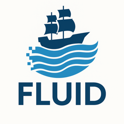
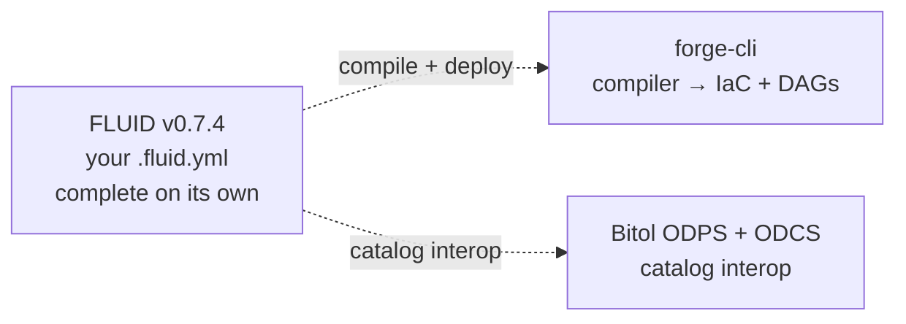

<p align="center">
  
</p>

<h1 align="center">FLUID</h1>

<p align="center"><strong>Federated Layered Unified Interchange Definition</strong></p>
<p align="center">The open, declarative standard for Data Products — built for the agentic era.</p>

<p align="center">
  <a href="https://open-data-protocol.github.io/fluid/">📖 Documentation</a> ·
  <a href="https://open-data-protocol.github.io/fluid/schema/anatomy">🧭 Schema Anatomy</a> ·
  <a href="https://open-data-protocol.github.io/fluid/examples/">🚀 Examples</a> ·
  <a href="https://open-data-protocol.github.io/fluid/concepts/comparisons">🔄 vs ODCS / ODPS</a> ·
  <a href="https://open-data-protocol.github.io/fluid/releases/0.7.4">✨ What's New</a>
</p>

---

FLUID is one YAML file that describes a data product end to end — **schema, build, orchestration, agentic governance, sovereignty, and semantics**. Write it once; validate it, compile it, and deploy it anywhere. It compiles to Bitol ODPS + ODCS for catalog interop via the reference compiler, [`forge-cli`](https://github.com/Agenticstiger/forge-cli).

## How the pieces fit


```mermaid
flowchart LR
    F["FLUID v0.7.4<br/>your .fluid.yml<br/>complete on its own"]
    FC["forge-cli<br/>compiler → IaC + DAGs"]
    BIT["Bitol ODPS + ODCS<br/>catalog interop"]
    F -.->|compile + deploy| FC
    F -.->|catalog interop| BIT
```

FLUID is **standalone** — the contract is complete on its own. Everything else is an optional adapter.

## Minimal valid contract

```yaml
fluidVersion: "0.7.4"
kind: DataProduct
id: demo.bronze.hello_world
name: Hello World
metadata:
  owner:
    team: data-platform
exposes:
  - exposeId: hello
    kind: table
    contract:
      schema:
        - name: id
          type: STRING
          required: true
    binding:
      platform: local
      format: parquet
      location:
        path: ./hello.parquet
```

→ Build it up step by step in **[FLUID by Example](https://open-data-protocol.github.io/fluid/examples/)**.

## JSON Schema

- **Latest:** `https://open-data-protocol.github.io/fluid/schema/fluid-schema-0.7.4.json`
- Use it in your editor — add this line to any `.fluid.yml`:
  ```yaml
  # yaml-language-server: $schema=https://open-data-protocol.github.io/fluid/schema/fluid-schema-0.7.4.json
  ```
- All versions, diffs, and the generated HTML reference: **[Schema → Versions](https://open-data-protocol.github.io/fluid/schema/versions)**.

> **Note:** 0.7.4 ("Runtime agentPolicy Enforcement at the MCP Gateway") is **additive and fully backward-compatible** with 0.7.3 — every valid 0.7.3 contract still validates. See **[What's New in 0.7.4](https://open-data-protocol.github.io/fluid/releases/0.7.4)**.

## Build the docs locally

```bash
npm install
npm run docs:dev      # http://localhost:8080/fluid/
npm run docs:build    # static site → docs/.vuepress/dist
```

The site is built with [VuePress 2](https://v2.vuepress.vuejs.org/) and deployed to GitHub Pages. Schema files and the generated HTML specs are mirrored into the published site by `scripts/sync-public-assets.mjs`, so `…/fluid/schema/*.json` keeps resolving.

## Contributing & license

PRs welcome — see the **[Contributing Guide](https://open-data-protocol.github.io/fluid/contributing/)**. Licensed under the [MIT License](LICENSE).
