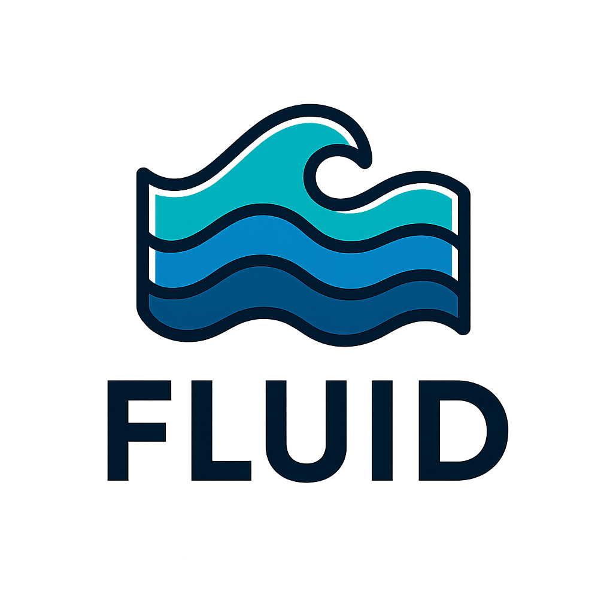

<p align="center">
  
</p>

# Federated Layered Unified Interchange Definition

> **The open, declarative standard for Data Products.**  
> FLUID provides the foundational protocol for building trustworthy, governable, and scalable data ecosystems—ready for the agentic era.

---

## 🚀 Vision: Your Data, Ready for the Agentic Revolution

The enterprise is on the verge of a paradigm shift: from process automation to an Agentic Ecosystem, where autonomous AI agents drive operations. This transition, powered by standards like the Model Context Protocol (MCP), exposes a foundational crisis—our data infrastructure is a patchwork of brittle, imperative pipelines, fundamentally unready for agentic consumption.

**FLUID** (Federated Layered Unified Interchange Definition) is introduced as an open-source specification to solve this crisis. FLUID reframes data from a pipeline byproduct into a first-class Data Product with a clear interface, contract, and implementation. By providing a declarative, version-controlled, and unified definition for every data asset, FLUID establishes the trustworthy, governable, and scalable data fabric necessary for the agentic era.

Agents can't operate in a vacuum—they require access to data that is:

- Discoverable
- Trustworthy
- Context-aware

Without it, agents inherit brittle pipelines, stale lineage, and governance nightmares.

---
## The Looming Crisis of Context

The "modern data stack"—a disaggregated ecosystem of best-in-class tools—has enabled rapid progress, but is held together by fragile scripts, proprietary configs, and tribal knowledge. This complexity, manageable by humans, becomes a liability in the Agentic Revolution.

**Agentic AI**—capable of complex reasoning and autonomous tool use—will soon be the primary consumer of enterprise data. Their potential, however, is capped by the quality and reliability of accessible data.

**Key Questions:**
- How can an agent trust the data it consumes?
- How does an agent discover the correct data product?
- How can we govern and audit thousands of autonomous agents accessing sensitive data?

The current landscape, built on disconnected pipelines, offers no scalable answers. Deploying agents atop this foundation is like building a skyscraper on sand. What’s needed is a paradigm shift: from data as pipeline output to data as a product with a contract.

**FLUID** is that foundational, declarative protocol.

---

## What FLUID Is (and Is Not)

### What It Is: A Declarative Protocol for Data Products

FLUID is a **declarative specification** (YAML, version-controlled) that defines a data product in its entirety. It is not an execution engine, but a universal language for tools across the data ecosystem.

**Core Philosophy:**
- **Federated:** Distributed, co-located with code and teams, enabling domain-oriented data mesh.
- **Layered:** Supports logical layers (Bronze, Silver, Gold) for data refinement.
- **Unified:** Unifies the entire data product lifecycle—interface, dependencies, build logic, contracts, and access policies.
- **Interchange Definition:** A common format for exchanging data product definitions between tools, teams, and agents.

**Primary Interfaces:**
- `exposes` (Output Port): Public interface—location, contract (schema, quality, privacy), access policy, capabilities.
- `consumes` (Input Port): Dependencies—physical sources or other FLUID products.
- `build` (Implementation): Logic for output creation—transformation engine, execution runtime, state management.

This structure separates the "what" (interface) from the "how" (construction), enabling scalable, understandable data ecosystems.

### What It Is Not: A Monolithic Executor

FLUID is **not** a new central tool or platform. It does not replace Airflow, dbt, or Snowflake. It does **not** require a monolithic "Agentic Executor."

Instead, FLUID fosters a **decentralized, compliant ecosystem**. Tools become "FLUID-aware"—for example, Airflow dynamically generates DAGs from FLUID files, and data catalogs ingest lineage from FLUID repositories. FLUID is the shared language, not the central brain.

---

## Why FLUID Is Indispensable in an MCP World

**Can’t a smart AI just “get the data”? Why bother with data products?**

No matter how advanced, an AI agent cannot operate on data it does not understand or trust. Connecting to raw databases is a liability, not an asset. FLUID closes three critical gaps:

- **Semantic Gap:** Without a contract, data is just bits. FLUID’s contract and semantics provide essential context—schema, descriptions, business ontology links.
- **Trust Gap:** How does an agent know data is correct or fresh? FLUID’s quality and SLA blocks provide enforceable guarantees.
- **Governance Gap:** How do we control and audit agent access? FLUID’s accessPolicy and dynamicPolicies create a programmatic access control layer.

**Conclusion:** AI cannot “just get the data.” FLUID provides the machine-readable contracts and policies that transform raw data into safe, trustworthy, and understandable Data Products.

---

## 📈 Why Mandate FLUID?

### 1️⃣ Drastically Reduce Operational Risk & Complexity

- Replace glue code with declarative `.fluid.yml`
- Built-in governance, compliance & versioning

### 2️⃣ Increase Innovation Velocity

- Treat data as products
- Discoverable, composable, contract-driven data

### 3️⃣ Future-Proof for the Agentic Era

- Machine-readable
- Secure
- Ready for AI-first enterprise infrastructure

---

## 🏗️ Core Principles

| Principle               | Description                                                                 |
|-------------------------|-----------------------------------------------------------------------------|
| **Data as a Product**   | Versioned assets with owners, SLAs, and contracts                           |
| **Declarative**         | Define *what* not *how* — let the tools figure it out                      |
| **Contracts as Code**   | Governance built into your version-controlled spec                          |
| **Federated Ownership** | Aligns with Data Mesh, supports decentralized domains                       |
| **Compliant Ecosystem** | FLUID-aware tools configure themselves using `.fluid.yml`                   |

---

## ✨ Example Journey: From Source to Consumer

### 🥉 Bronze Layer — Source-Aligned
```yaml
# finance.bronze.raw_payments.fluid.yml
fluidVersion: 1.1
kind: DataProduct
metadata:
  dataProduct: finance.bronze.raw_payments
  owner: { team: 'data-platform' }
  description: "Ingests raw, unprocessed payment events..."
consumes:
  - type: kafka
    properties:
      topic: 'prod.financial.payments'
exposes:
  location:
    type: gcs
    format: { type: 'parquet' }
    properties:
      bucket: 'prod-finance-landing-zone'
  contract:
    schema:
      columns:
        - name: paymentId
          type: STRING
        - name: amount
          type: NUMERIC
        - name: currency
          type: STRING
        - name: user_pii
          type: JSON
    quality:
      - rule: "amount > 0"
    privacy:
      - classification: PII
        columns: [user_pii]
        treatment: { type: masking }
```

### 🥈 Silver Layer — Domain-Aligned
```yaml
# marketing.silver.transformed_campaign_performance.fluid.yml
kind: DataProduct
metadata:
  dataProduct: marketing.silver.transformed_campaign_performance
  owner: { team: 'marketing-analytics' }
  description: "A clean, modeled table of campaign performance."
build:
  transformation:
    engine: dbt
    properties:
      projectDir: './dbt/marketing_project/'
```

### 🥇 Gold Layer — Consumer-Aligned
```yaml
# ml.gold.customer_churn_features.fluid.yml
kind: DataProduct
metadata:
  dataProduct: ml.gold.customer_churn_features
  owner: { team: 'ml-engineering' }
  description: "Features for the churn prediction model"
exposes:
  location:
    type: redis
    connection: secret:ml-feature-store-redis-creds
  contract:
    schema:
      columns:
        - name: customer_id
          type: STRING
        - name: ltv
          type: NUMERIC
```

---

## 🙋‍♀️ FAQ & Black Hat Review

### ❓ Q1: Isn’t this just another abstraction?

**A:** No. FLUID replaces *glue code* with declarative configuration. It unifies, not layers.

---

### ❓ Q2: Does FLUID replace dbt or Airflow?

**A:** No. It **enhances** them. Tools become FLUID-aware by consuming `.fluid.yml`.

---

### ❓ Q3: What is an “Agentic Executor”?

**A:** A concept. Think of CI/CD pipelines or agent runtimes that interpret `.fluid.yml` and take action.

---

### ❓ Q4: What if I need custom Python transformations?

**A:** FLUID supports it—just explicitly declare lineage and inputs.

---

### ❓ Q5: How can a big org realistically adopt this?

**A:** Incrementally. Start with one team or domain. Show value. Let adoption grow organically.

---

## 📚 Learn More

📖 [FLUID v1.0 Full Specification](#)  
🧑‍💻 [Contributing Guide](#)  
📜 [License (Apache 2.0)](LICENSE.md)

---

## 🤝 Join the Movement

- Help build the **agentic data future**
- Contribute examples, tooling, or feedback
- Be part of an open, community-led protocol

---

> **Your agents are only as trustworthy as the data products they consume. Make FLUID your foundation.**
