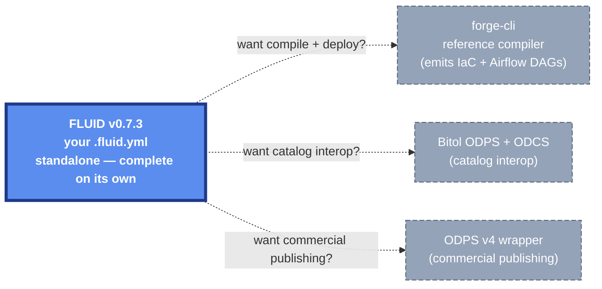

# 🔄 How FLUID Compares to ODCS, Bitol ODPS, and ODPS v4

Four active "open data product" specs share overlapping names and adjacent scopes — three are Linux Foundation projects. This page disambiguates them, shows how they fit together, and presents a capability matrix sourced directly from each spec's published JSON Schema.

## TL;DR

- 🟢 **Bitol ODCS** — column-level technical contract (schema · DQ · SLA · roles · pricing tier)
- 🟢 **Bitol ODPS** — thin product manifest that references ODCS contracts via `contractId`
- 🟣 **ODPS v4** — commercial wrapper (pricing plans · payment gateways · license · i18n · marketplace)
- 🔵 **FLUID** — operational superset (contract + build + orchestration + agentic governance + sovereignty + multi-layer DQ + semantics); compiles to Bitol ODPS+ODCS via `forge-cli` for ecosystem interop

> All four are open source (Apache 2.0; FLUID is MIT). They aren't mutually exclusive — see the diagram below.

## Disambiguation — which "ODPS" is which?

| Acronym | Maintainer | Latest | What it is |
|---|---|---|---|
| **ODCS** (Open Data Contract Standard) | LF AI & Data · Bitol | v3.1.0 — Dec 2025 | Column-level technical contract; producer↔consumer agreement for one dataset |
| **Bitol ODPS** (Open Data Product Standard) | LF AI & Data · Bitol | v1.0.0 — Sep 2025 | Thin product manifest; bundles ODCS contracts via `contractId` on input/output ports |
| **ODPS v4** (Open Data Product Specification) | LF · [Open-Data-Product-Initiative](https://github.com/Open-Data-Product-Initiative/v4.0) | v4.0 — Jul 2025 · v4.1 — Oct 2025 | Business + commercial wrapper: pricing · license · multi-language · marketplace |
| **FLUID** | open-data-protocol | v0.7.3 — this repo | End-to-end operational contract: schema + build + orchestration + agentic governance + sovereignty + semantics |

## How they actually fit together

<MermaidLazy>

</MermaidLazy>

> **FLUID stands on its own.** The boxes above (with dashed borders) are **optional adapters** — pick only what you need. Most teams start with just FLUID, then add `forge-cli` once they want compiled IaC / Airflow DAGs, then add Bitol catalog export when they want data-mesh registry interop, then add ODPS v4 if they're publishing data products commercially.

> 🖱️ Every node in the diagram links to its source repository.

> **From the [forge-docs](https://agenticstiger.github.io/forge_docs/):** *"Bitol Open Data Product Standard v1.0.0 as the default, center-stage ODPS"* — export produces *"1 ODPS doc + N sibling `<contractId>.odcs.yaml` files."*

---

## 📊 Capability matrix

Legend: ✅ deterministic in spec · ⚠️ partial · ❌ silent. Headers abbreviated for width: **F** = FLUID v0.7.3 · **ODCS** = Bitol ODCS v3.1 · **ODPS** = Bitol ODPS v1.0 · **v4** = ODPS v4.0. Field-level detail lives in the [**Schema Cheatsheet**](/fluid/schema/cheatsheet) — this matrix is the at-a-glance scoreboard.

### 📐 Data shape & quality

| Capability | F | ODCS | ODPS | v4 |
|---|---|---|---|---|
| Schema | ✅ | ✅ | ❌ delegated | ❌ delegated |
| Data quality | ✅ 3-layer | ✅ rich | ❌ | ✅ declarative |
| SLA / SLO | ✅ 4 SLOs | ✅ 11 dims | ❌ | ✅ 11 dims |
| Privacy / sensitivity | ✅ 12-value + masking | ✅ per-column | ❌ | ⚠️ metadata only |

### 🔒 Access, governance & legal

| Capability | F | ODCS | ODPS | v4 |
|---|---|---|---|---|
| Access (IAM) | ✅ grants + conditions | ✅ roles | ❌ | ⚠️ free-text |
| Lineage | ✅ top-level graph | ⚠️ column hints | ⚠️ product-level | ⚠️ pointer |
| AI / LLM governance | ✅ `agentPolicy` | ❌ | ❌ | ⚠️ MCP access only |
| Sovereignty / residency | ✅ jurisdiction + enforcement | ❌ | ❌ | ⚠️ partial |
| Legal framework | ✅ regulatory · 10 + 6 | ❌ | ❌ | ✅ commercial · license / IPR |

### ⚙️ Build & operations

| Capability | F | ODCS | ODPS | v4 |
|---|---|---|---|---|
| Build / transformation | ✅ 4 patterns | ❌ | ❌ | ⚠️ pointer only |
| Source-aligned ingestion | ✅ 6 engines | ❌ | ❌ | ❌ |
| Orchestration | ✅ Airflow / Dagster / Prefect / Kubeflow | ❌ | ❌ | ⚠️ metadata only |
| Retention | ✅ `retention` | ❌ | ❌ | ❌ |
| Delivery guarantees | ✅ `acquisitionDelivery` | ❌ | ❌ | ❌ |

### 🧭 Discovery & semantics

| Capability | F | ODCS | ODPS | v4 |
|---|---|---|---|---|
| Semantic model | ✅ `semantics` · [OSI](https://open-semantic-interchange.org/) v1.0 | ❌ | ❌ | ❌ |
| Business metadata | ⚠️ basic | ⚠️ basic | ⚠️ basic | ✅ full i18n `details.<lang>` |
| Multi-access | ✅ `exposes[]` independent | ❌ single | ⚠️ free-form | ✅ 6-value enum |

### ♻️ Lifecycle & supply chain

| Capability | F | ODCS | ODPS | v4 |
|---|---|---|---|---|
| Lifecycle states | ✅ 4-state | ⚠️ free-form | ✅ 5-state | ✅ 8-state |
| Versioning + schema evolution | ✅ `schemaEvolution` + 4-policy | ⚠️ `version` only | ⚠️ port + product | ⚠️ `productVersion` |
| SBOM | ⚠️ image signature | ❌ | ✅ `sbom[]` | ❌ |

> Each capability links to its field-level reference in the [**Schema Cheatsheet**](/fluid/schema/cheatsheet). MetricFlow round-trip is on the FLUID roadmap.

> ⚙️ The matrix above shows what each spec *covers*. **[`forge-cli`](/fluid/concepts/forge-cli)** is the reference compiler that turns a FLUID contract into deployed reality and Bitol-compatible outputs.

---

## When to use which

- **Use Bitol ODCS alone** when you need a portable, vendor-neutral **column-level contract** any data-mesh tool can consume. The smallest unit of producer↔consumer agreement.
- **Use Bitol ODPS** when you want a thin manifest to bundle multiple ODCS contracts into one product (ports + SBOM + lifecycle) without build automation or AI governance.
- **Use opendataproducts.org's ODPS v4** when you're **commercializing data products** — pricing tiers, payment integration, multi-language license, marketplace metadata. It expects an ODCS-shaped contract underneath.
- **Use FLUID** as your **authoring layer** when you want one file to drive the full lifecycle — source-aligned acquisition, build, orchestration, agentic governance, sovereignty, multi-layer DQ, and semantics — *and* you want Bitol-compatible outputs for catalog/contract-registry interop. FLUID is the only spec covering the operational + agentic surface today.

## Composing them

The cleanest production stack uses all four where each is strongest:

| Layer | Spec | Role |
|---|---|---|
| Author | **FLUID** | Single `.fluid.yml` per product — version-controlled, schema-validated, agent-policy-enforced |
| Compile | **forge-cli** | Emits Bitol ODPS + ODCS files, generates Airflow DAGs, applies IAM grants, runs DLP pre-land hooks |
| Catalog | **Bitol ODCS + ODPS** | What DataHub / OpenMetadata / Datamesh Manager read for discovery and contracts |
| Commercialize | **ODPS v4** | Wraps the ODCS for external marketplace publishing — pricing, license, multi-language, payment |

## Sources

- [Bitol ODCS — open-data-contract-standard](https://github.com/bitol-io/open-data-contract-standard) (v3.1.0)
- [Bitol ODPS — open-data-product-standard](https://github.com/bitol-io/open-data-product-standard) (v1.0.0)
- [opendataproducts.org ODPS v4](https://opendataproducts.org/v4.0/) · [v4.0 repo](https://github.com/Open-Data-Product-Initiative/v4.0) · [v4.1 release](https://github.com/Open-Data-Product-Initiative/v4.1)
- [forge-cli — the FLUID reference compiler](https://github.com/Agenticstiger/forge-cli) · [forge-docs](https://agenticstiger.github.io/forge_docs/) (emits Bitol ODPS + ODCS)
- [Linux Foundation AI & Data — Bitol project](https://lfaidata.foundation/projects/bitol/)

---

→ See [**The Agentic-Native Layer**](/fluid/concepts/agentic-native) for the four agent failure modes each spec is tested against.
